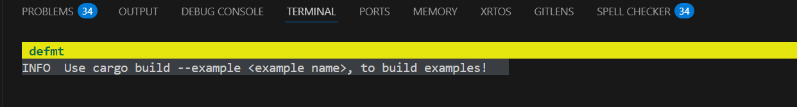

# Hello World! In embedded rust! 
To print hello world to the user, we need a way to send serial messages, in this case we use the debugger probe-rs with defmt. You might say, but what about other debuggers like GBD or openOCD? 
My answer is no, here we are going full rust, or get scuffed. 

Add the debugger to our dependencies in `Cargo.toml`:  
```toml
Cargo.toml
[dependencies]
defmt = "1.0.1"
defmt-rtt = "1.0.0"
panic-probe = { version = "1.0.0", features = ["print-defmt"] }
```

Then we import the debugger into our main function, use `info!` to to send a message to the terminal:  
```rust
main.rs
// Import defmt debugger
use defmt::*;         // Debugger
use defmt_rtt as _;   // Use defmt as global rtt logger
use panic_probe as _; // Panic handler with defmt support

#[entry] 
fn main() -> ! {
    // Use info! to print a message to the terminal. 
    info!("Hello World!");

    loop {}
}
```

## Complete Example
Here is a complete code example, it is the default example, and can be run with:
```sh
$ cargo build
$ cargo embed
```

```rust
#![deny(unsafe_code)]
#![no_main]
#![no_std]

// Crates
use cortex_m_rt::entry; // ARM dependencies for cortex-m architecture
use stm32f4xx_hal as _; // STM32F4 series HAL crate

// Debugger
use defmt::*;
use defmt_rtt as _;     // Global logger
use panic_probe as _;   // Panic handler with defmt support


// MAIN
#[allow(clippy::empty_loop)] 
#[entry] 
fn main() -> ! {
    info!("Use cargo embed --example <example name>, to build examples!");

    loop {}
}
```

Don't forget to have you STM32F4 connected! A terminal should open and look like this:



