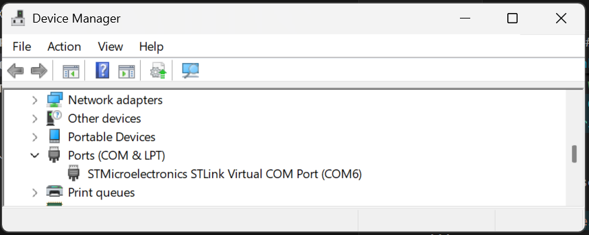
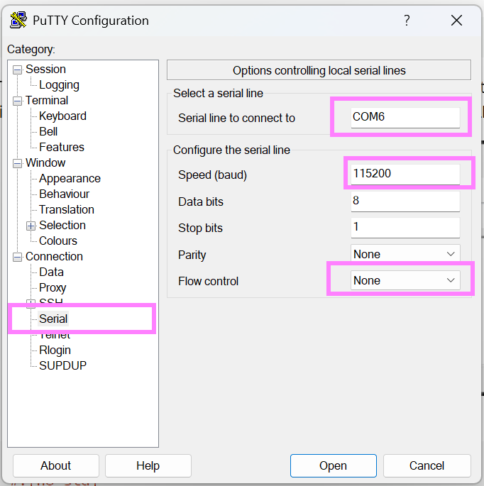
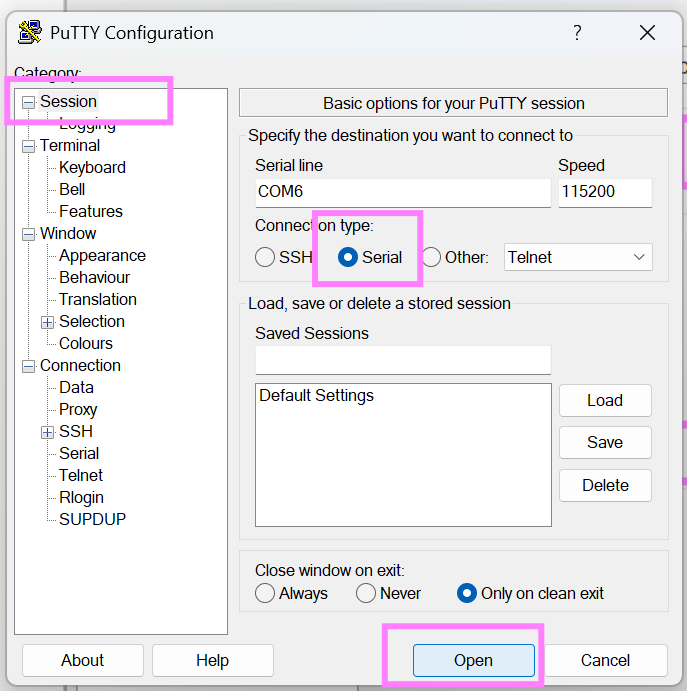
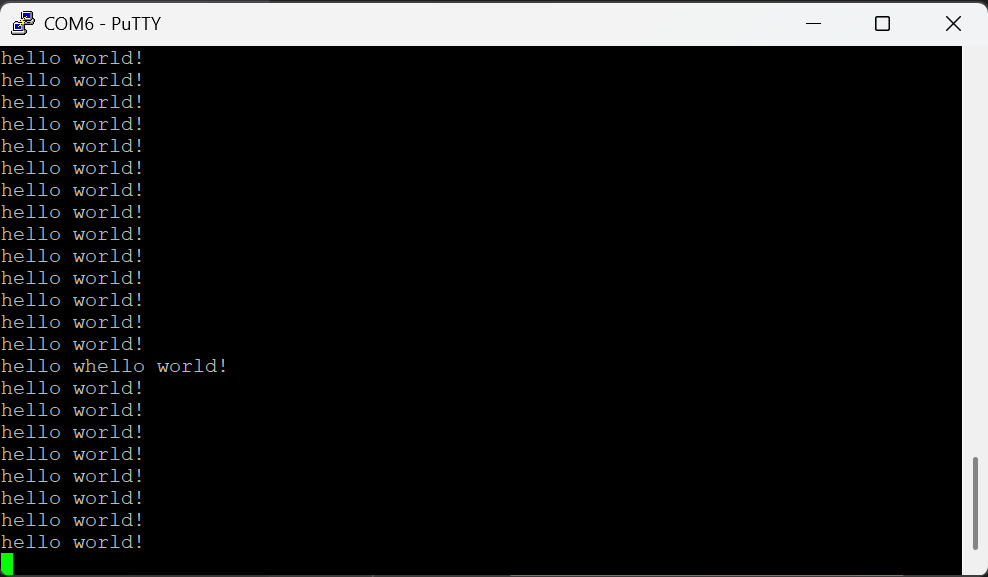

# UART
Now we will have a look at UART communication. The bread-and-butter communication between a PC and MCU.  

To use UART on the STM32F4, we need to include the `serial` module:
```rust
use stm32f4xx_hal::{
    pac,
    prelude::*,
    serial::{config::Config, Serial},
};
```
* `config::Config` - A struct containing the UART configuration.
* `Serial` - A struct used to set-up UART and pin configuration. 

```rust
use core::fmt::Write;
```
We include `core::fmt` to write formatted text over UART. 


Then, we configure our GPIO pins for UART. 
```rust
// Configure rx and tx pins
let tx = gpioa.pa2.into_alternate();
let rx = gpioa.pa3.into_alternate();
```
Here we set PA2 as TX pin and PA3 as RX pin. 

Then we create a a object for the serial communication, using USART2, our pins, serial configuration and clocks:
```rust
// Configure serial with default settings and baud rate of 115200. 
let serial_config = Config::default().baudrate(115_200.bps());
let mut serial = Serial::new(dp.USART2, (tx, rx), serial_config, &clocks).unwrap();
```

Now we can finally send a message!
```rust
writeln!(serial, "hello world!\r").ok();
```


## Complete Example
### Running the example code
Here is a complete code example, it is the default example, and can be run with:
```sh
$ cargo embed --example uart_hello_world
```

### Viewing UART serial messages using PuTTy
To view the UART messages, we can use Putty. We first need to figure out which COM port our MCU is on, we can find this in the device manager under "COM & LPT":
<figure>
  
  <figcaption>Figure 2 - Device manager showing COM ports.</figcaption>
</figure>

Next, we need to configure our serial connection in Putty, under Connection -> Serial:
<figure>
  
  <figcaption>Figure 2 - Putty serial settings.</figcaption>
</figure>

* Set "Serial line to connect to" to the COM port for your MCU, in my case COM6.
* Set "Speed" (baudrate) to 115200, the same we configured in our code.
* Set "Flow Control" to "None". 

Then, go to "Session" and select serial and press open. 
<figure>
  
  <figcaption>Figure 2 - Starting a Putty serial session.</figcaption>
</figure>

Assuming you have already flashed your MCU, you should be seeing these messages!
<figure>
  
  <figcaption>Figure 2 - Putty serial settings.</figcaption>
</figure>


### Code
```rust
// Compiler directives
#![no_std]
#![no_main]

// Libraries
// Generic
use cortex_m_rt::entry;
use defmt_rtt as _;
use panic_probe as _;

// UART Specific
use core::fmt::Write; // Used for formatted text over UART. 
use stm32f4xx_hal::{
    pac,
    prelude::*,
    serial::{
        config::Config, // Struct for storing the UART configuration.
        Serial // Struct used to initialize UART and pin configuration. 
    },
};


#[entry]
fn main() -> ! {
    // Take ownership of peripherals and configure clocks
    let dp = pac::Peripherals::take().unwrap();
    let rcc = dp.RCC.constrain();
    let clocks = rcc.cfgr.freeze();

    // Split out GPIO group A and configure rx and tx pins.
    let gpioa = dp.GPIOA.split();
    let tx = gpioa.pa2.into_alternate();
    let rx = gpioa.pa3.into_alternate();

    // Configure UART communication for 115200 baud rate on USART2. 
    let serial_config = Config::default().baudrate(115_200.bps());
    let mut serial = Serial::new(dp.USART2, (tx, rx), serial_config, &clocks).unwrap();

    // Clock cycle to ms conversion factor
    let ms: u32 = 8_000;


    loop {
        // Send UART message
        writeln!(serial, "hello world!\r").ok();

        // Wait for 1000 ms
        cortex_m::asm::delay(1000 * ms); // 1 second delay
    }
}
```