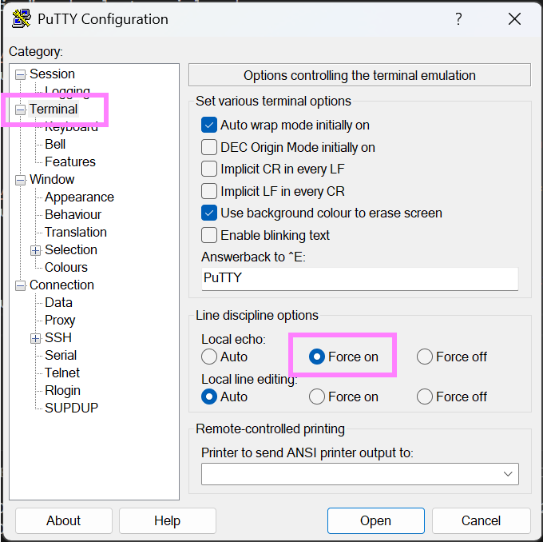

# Read and write UART on your PC using Putty
To read or write UART messages, we can use Putty. We first need to figure out which COM port our MCU is on, we can find this in the device manager under "COM & LPT":
<figure>
  
  <figcaption>Figure 2 - Device manager showing COM ports.</figcaption>
</figure>

Next, we need to configure our serial connection in Putty, under Connection -> Serial:
<figure>
  
  <figcaption>Figure 2 - Putty serial settings.</figcaption>
</figure>

* Set "Serial line to connect to" to the COM port for your MCU, in my case COM6.
* Set "Speed" (baudrate) to 115200, the same we configured in our code.
* Set "Flow Control" to "None". 

Then, go to "Session" and select serial and press open. 
<figure>
  
  <figcaption>Figure 2 - Starting a Putty serial session.</figcaption>
</figure>

Assuming you have already flashed your MCU, you should be seeing these messages!
<figure>
  
  <figcaption>Figure 2 - Putty serial settings.</figcaption>
</figure>

To send messages, you can write in the terminal. If you want to see your writing, the MCU has to either echo the your letters, or you can enable "Force Echo" on putty, by going to Terminal -> Local echo -> "Force on":
<figure>
  
  <figcaption>Figure 2 - Enable force echo on Putty.</figcaption>
</figure>