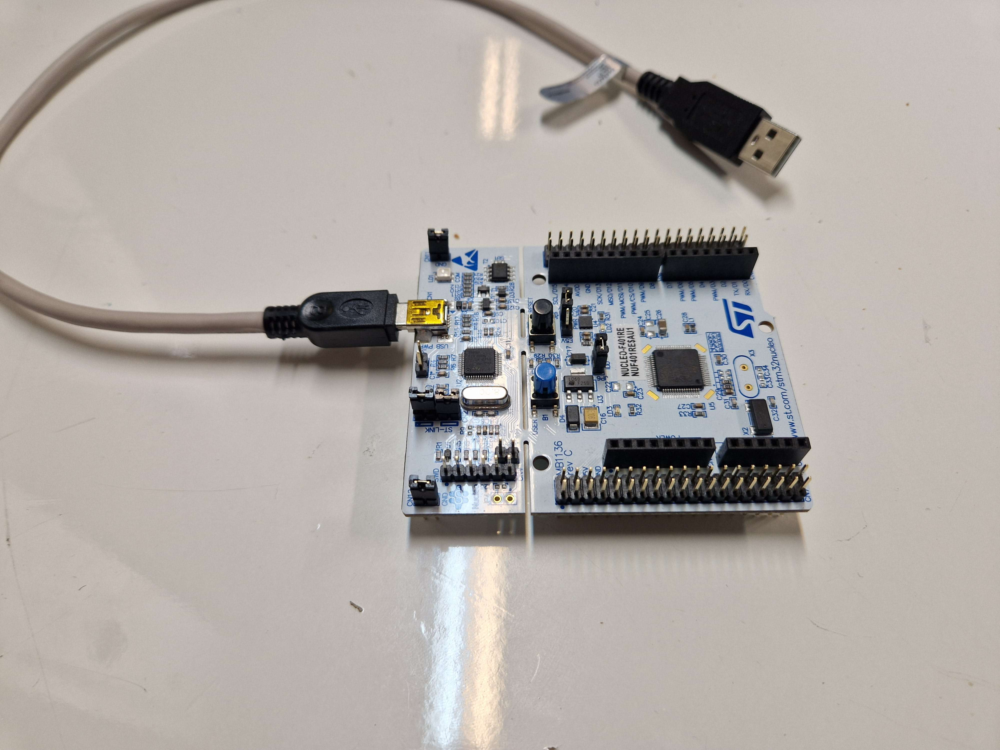

# Set-up
## Assumptions
You already have installed rust and VS Code. 
Maybe Windows 11. 


## Software
Install the rust tool chain
```sh
rustup install stable
rustup component add rust-src llvm-tools-preview
```

Install ARM Cortex-M target for STM32F4 series (Cortex-M4F with floating point unit (FPU))
```sh
rustup target add thumbv7em-none-eabihf
```

Install Probe-RS as our debugger probe.
```sh
cargo install probe-run
cargo install flip-link defmt-cli
```

Install cargo tools for embedded use
```sh
cargo install cargo-embed
```

*I also recommend installing the following VS Code Extentions:*
* rust-analyzer
* probe-rs-tools

## Hardware
<figure>
  
  <figcaption>Figure 1: The ST NUCLEO-F401RE development board, this is your wife now.</figcaption>
</figure>

You will need a ST NUCLEO-F401RE, is equivalent. 